# AFitness 系统架构图

> 本文档包含系统的各类架构图，使用Mermaid格式，可在GitHub、VS Code等环境中直接渲染。

## 目录

1. [系统整体架构](#1-系统整体架构)
2. [数据库ER图](#2-数据库er图)
3. [模块依赖关系](#3-模块依赖关系)
4. [API调用流程](#4-api调用流程)
5. [技术栈总览](#5-技术栈总览)

---

## 1. 系统整体架构

### 1.1 三层架构图

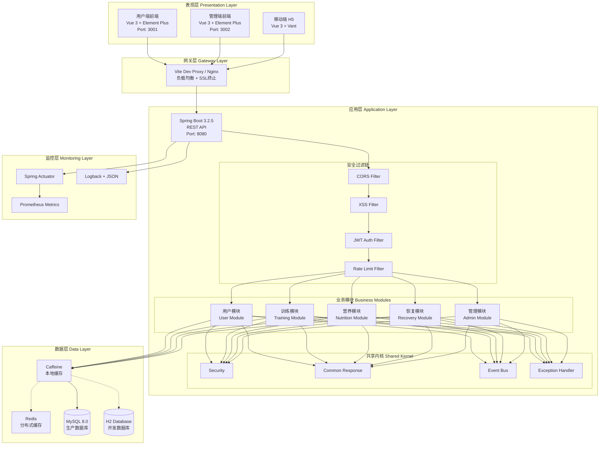

### 1.2 部署架构图

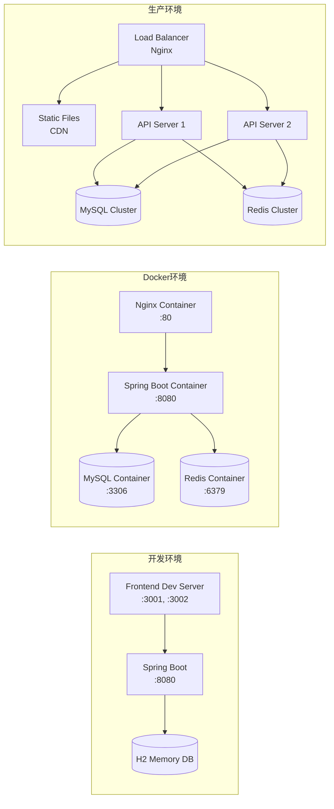

---

## 2. 数据库ER图

### 2.1 核心实体关系

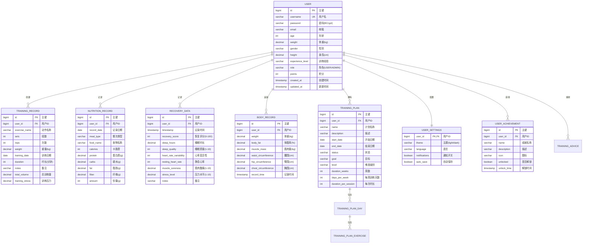

### 2.2 训练数据详细关系

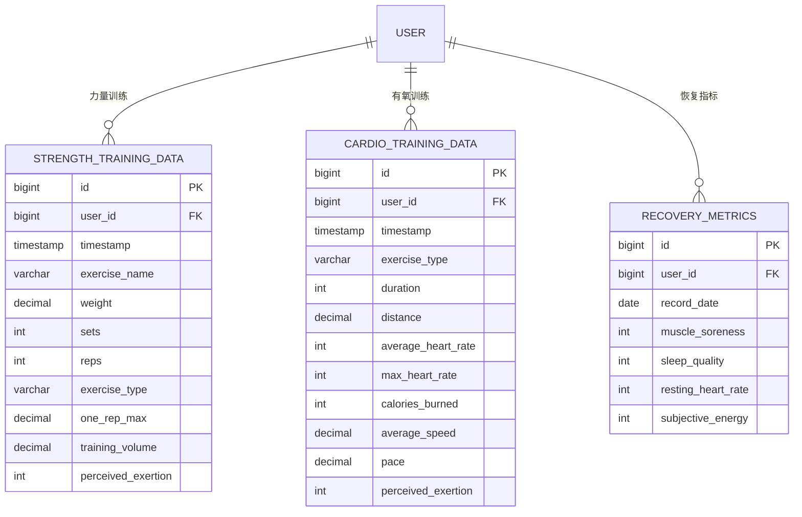

---

## 3. 模块依赖关系

### 3.1 后端模块依赖

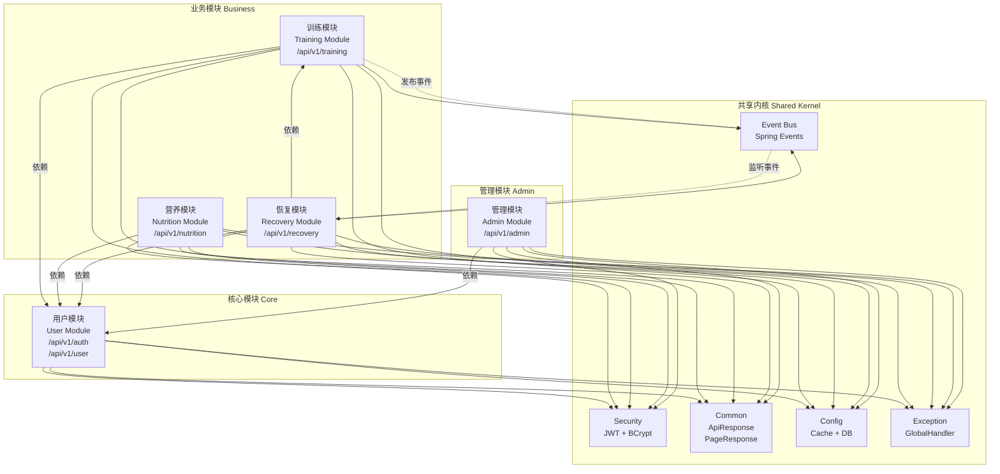

### 3.2 前端模块依赖

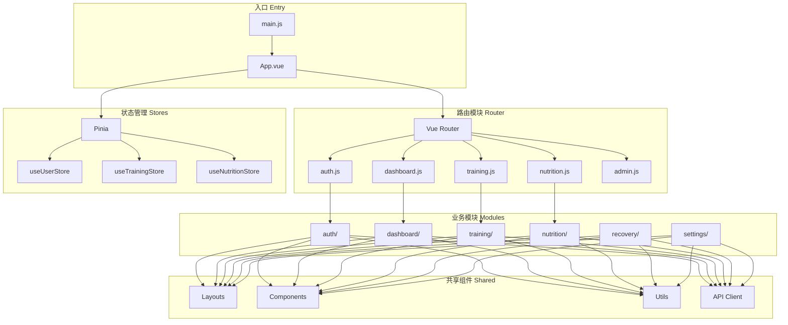

---

## 4. API调用流程

### 4.1 用户认证流程

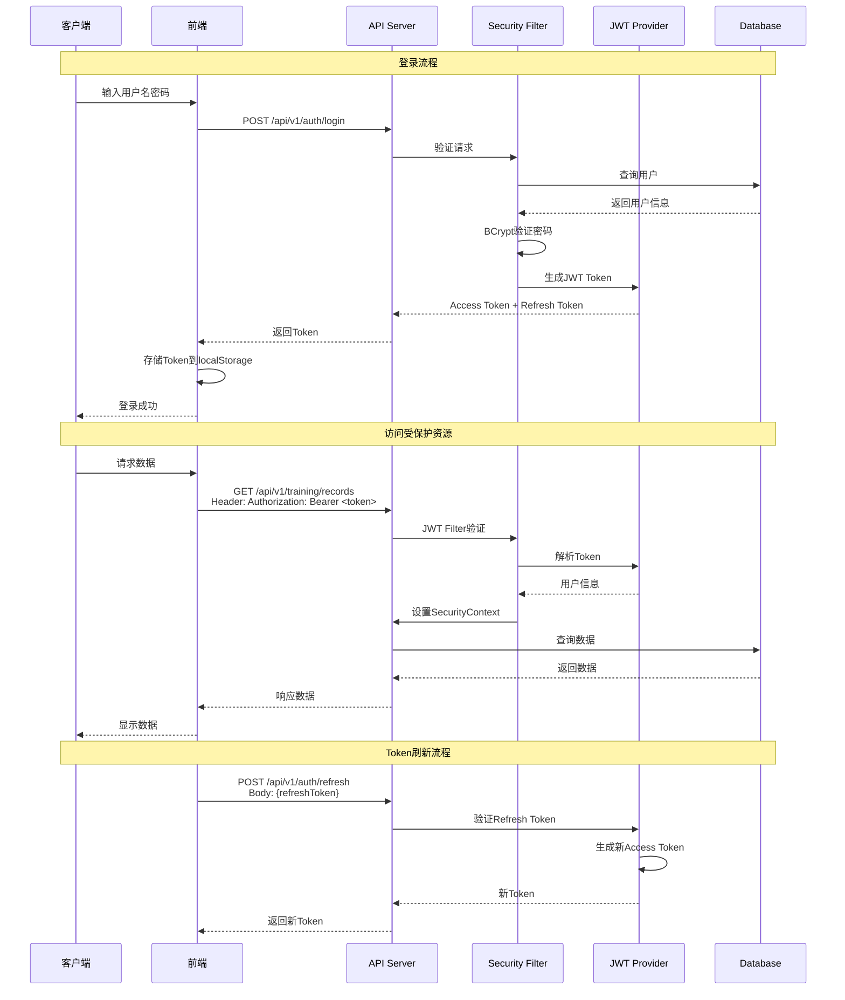

### 4.2 训练数据录入流程

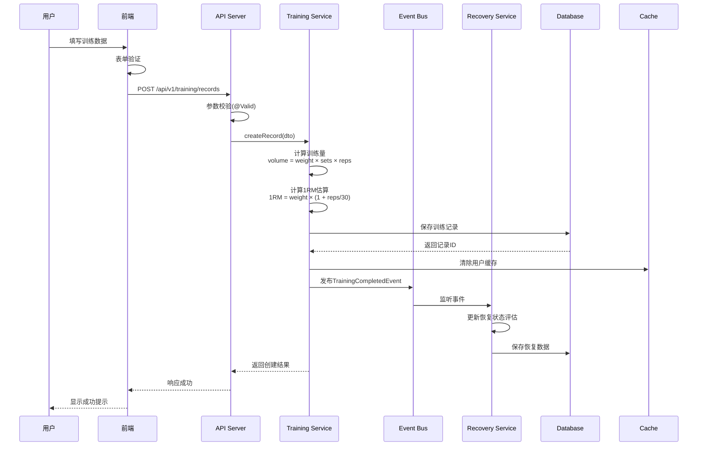

### 4.3 恢复状态评估流程

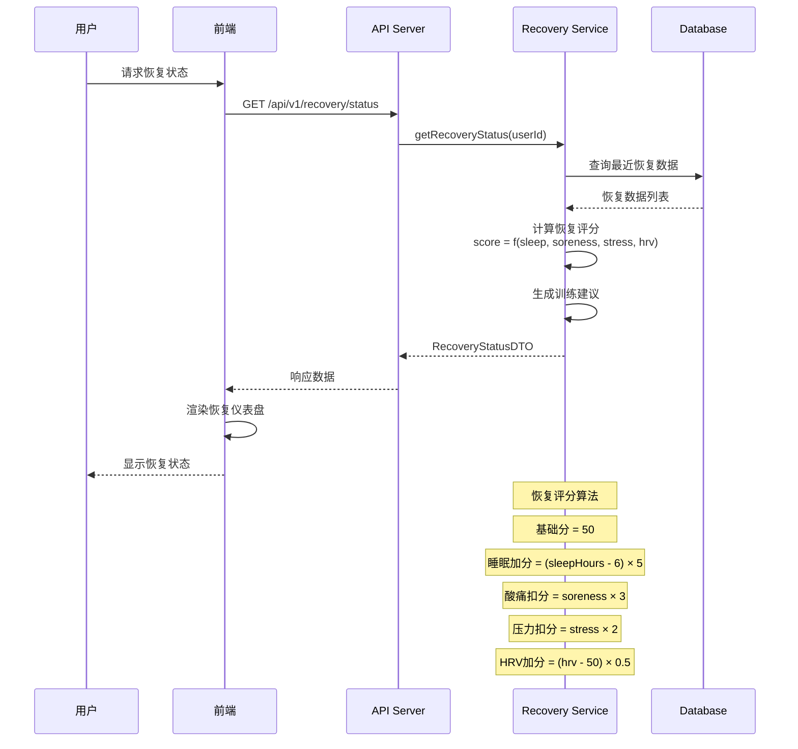

---

## 5. 技术栈总览

### 5.1 后端技术栈

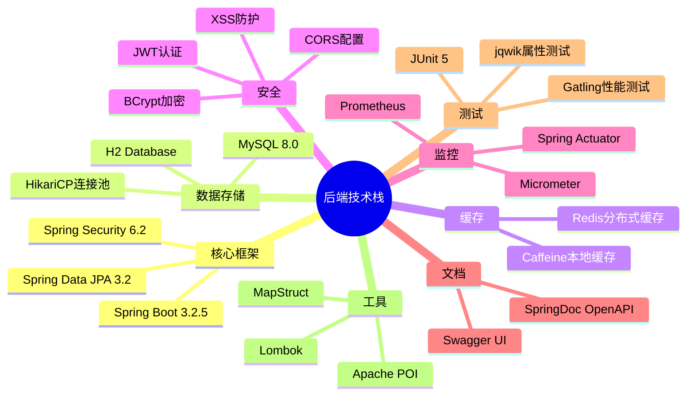

### 5.2 前端技术栈

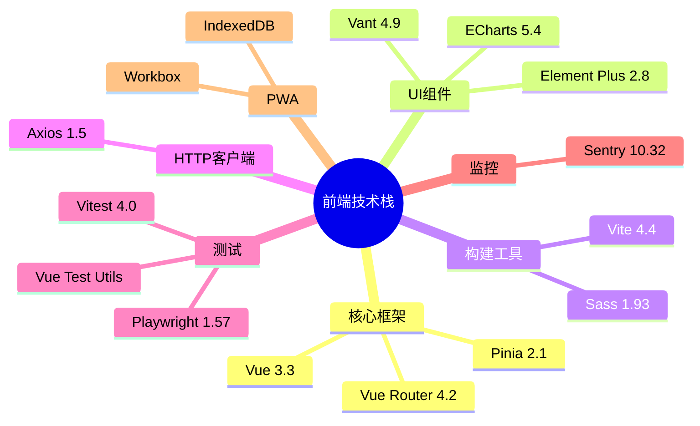

---

## 附录：图表渲染说明

本文档中的所有图表使用 [Mermaid](https://mermaid.js.org/) 语法编写，支持以下环境渲染：

- **GitHub**: 直接在仓库中查看即可渲染
- **VS Code**: 安装 "Markdown Preview Mermaid Support" 扩展
- **Typora**: 内置Mermaid支持
- **在线编辑器**: https://mermaid.live/

如需导出为图片，可使用 Mermaid CLI 或在线工具。
